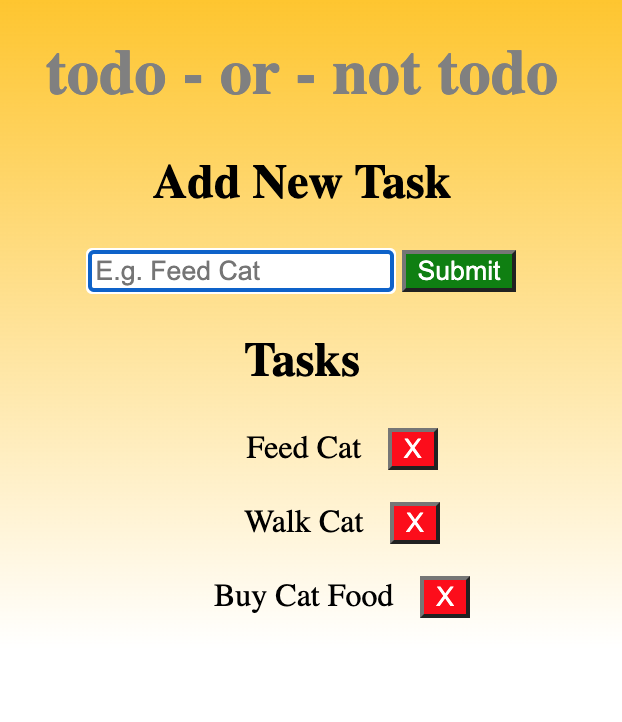

## Vanilla JavaScript To-Do Application

# Classic To-Do application using Javascript, HTML, and CSS

Considered to be a right of passage when learning to program, the classic "to-do" application steps up the knowledge required to complete a fully functional to-do app with all the fixins'.

## Jamie Vullo - Full-Stack Software Engineer - www.jamievullo.com